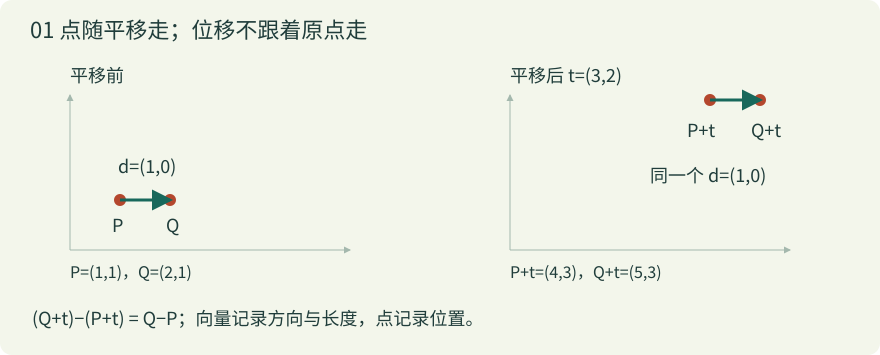
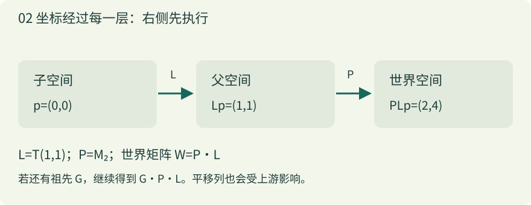
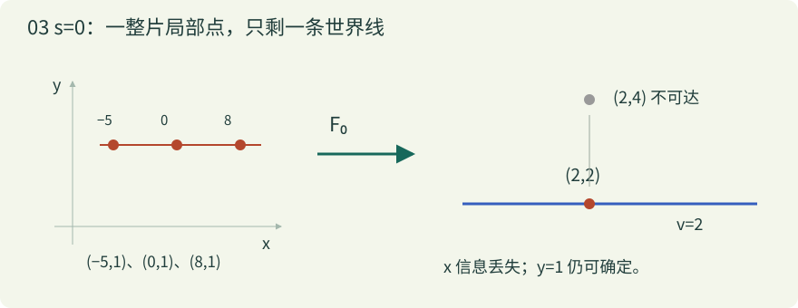

# 缩放为零之后，坐标去了哪里？

从一支箭头开始，重新理解父子变换与换父节点

全课使用列向量；x 向右、y 向上；矩阵乘积右侧先执行。先在二维建立直觉，再推广到三维。

预计精读约 90 分钟，可分三次完成。先预测、再操作、最后手算。所有内容可离线使用。

## 统一算例

F_s(x,y)=(3−y,2+s·x)，A_s=[[0,−1],[s,0]]。先 x 缩放 s，再逆时针 90°，最后平移 (3,2)。s=2 时 (1,1)→(2,4)。

## 01 点与向量：位置与位移是两件事

### 直觉

把一张方格纸铺在桌面上。点 P 是纸上的一个位置；向量 d 是一条指令：向右多少、向上多少。把箭头整体搬走，指令没有改变；把点搬走，位置就变了。

写下 (1,1) 时，两个数字本身不能告诉你它是点还是向量，还要知道语义和坐标系。点减点得到位移，点加位移得到另一个点，位移可以相加。点与点直接相加通常不是我们要表达的几何操作。

线性部分 A 改变位移的方向与长度；平移 t 改变原点的位置。于是点走 F(p)=Ap+t，而位移走 Ad。把位移也加上 t，就会把‘走一步’错误地当成‘某个地点’。

```text
点：F(p) = Ap + t
位移：F(Q) − F(P) = A(Q − P)
贯穿例：F_s(x,y) = (3 − y, 2 + s·x)
```



### 逐步算例

1. 先只看平移 t=(3,2)。点 P=(1,1) 变为 (4,3)，点 Q=(2,1) 变为 (5,3)。
2. 原来的位移 Q−P=(1,0)；移动后的位移 (5,3)−(4,3) 仍是 (1,0)。平移相减后消掉了。
3. 换成贯穿例 s=2。F(P)=(2,4)，F(Q)=(2,6)。位移变成 (0,2)，这来自线性部分的缩放和旋转，与 t 无关。

### 小练习

在 F_2 下，P=(1,1)、Q=(1,2)。分别算两个世界位置及它们的位移。

### 答案与理由

F_2(P)=(3−1,2+2×1)=(2,4)；F_2(Q)=(3−2,2+2×1)=(1,4)。相减得 (−1,0)。原位移是 (0,1)，它被转成向左一单位，没有再加平移 (3,2)。

既然同一支箭头能用数字表达，下一步就要问：这些数字是相对于哪两把‘尺子’？

## 02 基与坐标：数字是配方，基是尺子

### 直觉

平面上的标准基 e₁=(1,0)、e₂=(0,1) 就是两支单位箭头。坐标 (x,y) 的意思是拿 x 份第一支、y 份第二支，然后相加。数字是一份配方；基决定配方做出哪支箭头。

也可以选择斜着的尺子 b₁、b₂。只要两支箭头不共线，它们仍能唯一表达整个平面的向量。‘不共线’确保没有方向漏掉，也没有同一支箭头的两份不同配方。

若 b₁=(0,0)，无论取多少份第一支都没有贡献。这时它们不再构成平面的一组基。仍能做线性组合，但无法用这两支箭头唯一标记整个平面。别把所有‘两列箭头’都称为有效基。

```text
v = x·b₁ + y·b₂
b₁=(0,s)，b₂=(−1,0)
s=2：(1,1) 的组合 = (0,2)+(−1,0) = (−1,2)
```

### 逐步算例

1. 先用标准基表示 (1,1)：向右一步，再向上一步。
2. 把尺子换为 b₁=(0,2)、b₂=(−1,0)，配方仍取 (1,1)，得到的箭头却变为 (−1,2)。这是固定配方、改变几何箭头。
3. 反过来，若几何箭头固定为 (−1,2)，要问它在新尺子下的坐标，就求 x(0,2)+y(−1,0)=(−1,2)，得到 x=y=1。这是换坐标表达。
4. 令 s=0，组合变为 (−y,0)。配方 (1,1) 和 (9,1) 都得到 (−1,0)，x 已无法从结果分辨。

### 小练习

b₁=(2,0)、b₂=(1,1) 时，配方 (1,2) 得到什么向量？向量 (4,2) 的配方是否唯一？

### 答案与理由

1×(2,0)+2×(1,1)=(4,2)。反求时第二个分量要求 y=2，第一个分量要求 2x+y=4，所以 x=1。两尺不共线，这个配方唯一；尺子不必垂直。

把两支变换后的基箭头按列排在一起，就得到了矩阵。

## 03 矩阵的列：追踪两支单位箭头就够了

### 直觉

线性变换保留向量的相加和数乘：A(u+v)=Au+Av，A(cv)=cAv。因此，只要知道它如何处理 e₁、e₂，就知道它如何处理每个 x e₁+y e₂。

矩阵第一列就是 Ae₁，第二列就是 Ae₂。矩阵乘列向量不是一套凭空发明的乘法口诀，而是按照输入坐标把这些列加起来。

我们的 A_s 第一列 (0,s) 表示原来的 x 方向转到竖直方向并缩放；第二列 (−1,0) 表示原来的 y 方向转到向左。列向量约定贯穿全文；不要把另一套行向量乘法顺序直接混进来。

```text
A_s = [ 0  −1 ]     A_s [x] = x [0] + y [−1] = [−y]
      [ s   0 ]         [y]     [s]     [ 0]   [s·x]
```

### 逐步算例

1. 输入 e₁=(1,0)：只拿第一列，输出 (0,s)。
2. 输入 e₂=(0,1)：只拿第二列，输出 (−1,0)。
3. 输入 (1,1)、s=2：两列各拿一份，输出 (−1,2)。注意这一步还没平移。
4. 输入 (2,−1)、s=2：第一列拿两份，第二列拿负一份，输出 (1,4)。负数意味着沿相反方向走。

### 小练习

已知某线性变换把 e₁ 送到 (2,1)，把 e₂ 送到 (0,3)，写出矩阵并求 (1,2) 的像。

### 答案与理由

按列摆放得到 [[2,0],[1,3]]。输出为 1×(2,1)+2×(0,3)=(2,7)。如果把两个箭头写成行，就会得到另一个变换。

一个矩阵可以由多个操作组成。下一节追踪箭头，看看执行顺序为什么不能随意交换。

## 04 组合顺序：RS 与 SR 为什么不同

### 直觉

S 把当前输入坐标的 x 分量乘 s，R 再把箭头逆时针转 90 度。如果先旋转，原来朝 x 的箭头已经不朝 x 了，后面的 x 缩放作用在另一种方向上。

列向量写法中，RSp 是 R(Sp)，所以右侧先执行。矩阵乘法可以结合，却通常不能交换；括号可以改，操作顺序不能随意改。

当 s=1 时 S 是单位矩阵，两个顺序恰好相同；这只是特殊情况，不是顺序无关的证据。

```text
S = [[s,0],[0,1]]，R = [[0,−1],[1,0]]
RS = [[0,−1],[s,0]]，SR = [[0,−s],[1,0]]
F_s(p) = RSp + (3,2)
```

### 逐步算例

1. 取 p=(1,1)、s=2。先 S：得到 (2,1)。
2. 再 R：规则是 (a,b)→(−b,a)，所以得到 (−1,2)。最后平移得到 (2,4)。
3. 交换顺序：先 R 得到 (−1,1)，再 S 得到 (−2,1)。同样平移后得到 (1,3)。
4. 把这两个流程分别画出来。不同的是中间坐标，因此最终位置也不同。实验中的箭头顺序与屏幕 y 向下的绘图坐标转换已分离。

### 小练习

s=0、p=(1,1)，RS 与 SR 在平移前各得到什么？哪个输入分量被丢掉？

### 答案与理由

RS：S 先把 x 消掉，(1,1)→(0,1)→(−1,0)，丢掉原 x。SR：(1,1)→(−1,1)→(0,1)，丢掉原 y。两者都少一个方向，但压扁的对象不同。

到目前为止平移都另写一个加号。齐次坐标可以把它纳入同一次矩阵乘法。

## 05 仿射与齐次坐标：给平移留一列

### 直觉

线性变换必把零向量送到零，所以不能单独表示‘把原点移到 (3,2)’。仿射变换 F(p)=Ap+t 在这个线性骨架上再加一次平移。原来共线的点仍共线，但奇异变换也可能把整条线压成一点；端点没有重合时，同线上的分点比例保持。长度和角度一般不保持。

二维点补一个 1，写成 (x,y,1)；位移补一个 0，写成 (dx,dy,0)。第三列乘这个最后分量，点会得到平移，位移不会。这是记账方式，不是突然给平面增加一条可见空间轴。

仿射矩阵的最后一行是 (0,0,1)。两个这样的矩阵相乘仍是仿射矩阵；三维则用 4×4 矩阵和 (x,y,z,1)。本课不涉及透视投影需要的齐次除法。

```text
M_s = [ 0  −1  3 ]     M_s [x] = [3−y  ]
      [ s   0  2 ]         [y]   [2+s·x]
      [ 0   0  1 ]         [1]   [1    ]
[A,t]·[B,u] = [AB, A·u+t]  （省略最后一行）
```

### 逐步算例

1. 用 M₂ 乘点 (1,1,1)：第一行为 0×1−1×1+3×1=2，第二行为 2×1+0×1+2×1=4。
2. 用同一矩阵乘位移 (1,1,0)：第一行为 −1，第二行为 2。平移项乘零，不参与结果。
3. 若先在局部平移 u=(1,1)，再经过 A₂ 与 t，那么新原点是 A₂u+t=(2,4)，不是 t+u=(4,3)。上游会继续变换下游的平移。

### 小练习

在 M₀ 下，点 (7,1,1) 和位移 (7,1,0) 各变成什么？

### 答案与理由

点得到 (2,2,1)，位移得到 (−1,0,0)。两种输入的 x 都被压掉，但点仍保留平移 t；不能因为线性部分奇异，就把整个仿射矩阵说成全零矩阵。

把每一层局部坐标到上一层的仿射矩阵连乘，就得到父子变换。

## 06 局部、父级与世界：一路把坐标翻译出去

### 直觉

子物体的局部坐标像‘房间里的地址’，父级把房间安放到世界。L 把子物体的点送到父空间；P 把父空间的点送到世界空间。世界矩阵 W=PL，相当于连续做两次坐标翻译。

这里 P 指父物体的完整世界矩阵，包含所有祖先；不只是父物体 Inspector 上的 localScale。祖先若压掉一个方向，也可能让整个 P 奇异。挂点可以视为链条中再多一层变换。

L 的平移列是子原点在父空间的位置。W 的平移列是子原点在世界空间的位置；其余列描述子坐标轴在世界的方向和长度。只盯位置，无法看出网格是否被压扁或剪切。

```text
p_world = P·(L·p_child) = (PL)·p_child
L = [[1,0,1],[0,1,1],[0,0,1]]
P=M₂ → W=[[0,−1,2],[2,0,4],[0,0,1]]
```



### 逐步算例

1. 取 L 为局部平移 (1,1)，自身线性部分为单位矩阵。子原点 (0,0) 经 L 到父空间 (1,1)。
2. 父级 P=M₂ 再把 (1,1) 送到 (2,4)。因此 W 的平移列是 (2,4)。
3. 子物体的右侧点 (1,0) 经 L 到 (2,1)，经 P 到 (2,6)。它与子原点的世界位移是 (0,2)，等于 W 的第一列。
4. 若 P=M₀，子原点成为 (2,2)，右侧点也成为 (2,2)。子物体没有在局部消失；是从局部到世界的映射把一族点叠在一起。

### 小练习

增加一个祖先 G，只做向右平移 (10,0)。上例 P=M₂ 时，新的世界原点和第一列分别是什么？

### 答案与理由

新世界矩阵是 GPL，原点从 (2,4) 变成 (12,4)；第一列仍是 (0,2)。祖先的纯平移改变位置，不改变位移。若祖先有缩放或旋转，第一列也会继续变化。

从世界地址反查局部地址，就需要逆。先理解什么信息可恢复，再讨论如何计算。

## 07 逆、核、秩、行列式：四种描述同一次坍缩

### 直觉

逆不是简单地把乘号换成除号，而是一条能够唯一返回原输入的路线。若两个不同输入得到同一个输出，返回时就不知道该选哪一个。若有输出根本到不了，也就不可能对整个输出空间定义逆。

核 ker(A) 是被送到零的所有位移；两输入相差核中的向量，就会重叠。秩 rank(A) 是输出仍然拥有的独立方向数。像空间 im(A) 是能到达的线性输出集合；仿射变换可达集合是 t+im(A)。

二维行列式 ad−bc 是带符号的面积缩放因子。det(A_s)=s。s=0 时单位正方形被压成线，面积为零；s<0 时方向发生翻转，仍可逆。对于方阵，满秩、核只有零、行列式非零、存在逆互相等价。

s=0 时 A₀ 的核是所有 (x,0)，秩为 1；仿射像是世界直线 v=2。平移只把像空间搬到那里，不会凭空补回丢失的方向。

```text
u = 3−y，v = 2+s·x
s≠0：x=(v−2)/s，y=3−u  （唯一解）
s=0 且 v≠2：无解
s=0 且 v=2：y=3−u，x 任意  （无穷多解）
```



### 逐步算例

1. s=2，目标世界 (u,v)=(2,4)：由 u=3−y 得 y=1，由 v=2+2x 得 x=1。代回 F₂(1,1)=(2,4)。
2. s=0，目标 (2,4)：第二个方程变成 4=2，不成立，所以不是‘某个很大的局部 x’，而是没有解。
3. s=0，目标 (2,2)：第二个方程成为 2=2，没再约束 x。第一式要求 y=1，所以 (−5,1)、(0,1)、(8,1) 都能到达。
4. 伪逆能按指定准则选一个解：本例先减 t，再对 A₀ 用 Moore–Penrose 伪逆，会选最小欧氏长度的局部向量 (0,1)。这不证明原 x 曾经是零。目标 (2,4) 不可达时，它仍给 (0,1)，但回代只能到 (2,2)，留下世界残差 (0,2)。

### 小练习

在 s=0 下，目标 (5,2) 的全部局部解是什么？目标 (5,3) 呢？对解加上 (10,0) 会怎样？

### 答案与理由

(5,2) 要求 y=3−5=−2，x 任意。加上 (10,0) 只改变被丢弃的核方向，世界结果不变。(5,3) 因为 v≠2 无解。伪逆即便返回一个数值，也无法让不可能的方程成立。

精确零讨论有没有唯一解；接近零还可能有解，但输入误差会被放大。两件事需要分开。

延伸依据：[NumPy：numpy.linalg.pinv](https://numpy.org/doc/stable/reference/generated/numpy.linalg.pinv.html)。

## 08 精确零与近零：不可逆和误差敏感并不相同

### 直觉

在精确实数模型里，只要 s≠0，A_s 就可逆。不过 x=(v−2)/s 会把世界绝对误差 δv 放大为 δx=δv/s。像用被压得很短的尺子反读长度：刻度上的一点误差，回到原尺寸后可能很大。

条件数衡量相对误差在最坏方向上可能被放大的程度。本课使用线性部分的二范数条件数 κ₂(A)=σ_max/σ_min；奇异值可以先理解为两个主方向上的伸缩量。A_s 的奇异值是 |s| 与 1，所以 κ₂=max(|s|,1)/min(|s|,1)。

均匀缩放 sI 的两个方向一起变小，s≠0 时条件数仍为 1，但逆的范数为 1/|s|，所以仍放大绝对反求误差。小缩放或小行列式不自动等于相对病态。比如 0.000001I 的行列式是 10⁻¹²，而条件数为 1。

实际计算还有有限精度、下溢、上溢，以及 v 接近 2 时做减法的消去误差。浮点数可能在反求之前就把小增量舍掉。诊断时还要看量纲、数据误差、误差容许值；不能仅凭行列式阈值就替用户决定处理策略。

```text
A_s：κ₂ = max(|s|,1)/min(|s|,1)
sI：κ₂=1（s≠0），‖(sI)⁻¹‖₂=1/|s|
δx = δv/s；s=10⁻⁶，δv=10⁻⁴ → δx=100
```

### 逐步算例

1. 取 s=0.000001、真实 x=1。理想的 v=2.000001。
2. 世界测量多了 0.0001，变成 2.000101。反求 x=(2.000101−2)/0.000001≈101，与真实值相差约 100。
3. 若改成 sI，同样的世界绝对误差仍会除以 s；但理想世界位移和它的误差也处在同一缩放尺度，最坏相对误差放大比不再因方向差异增大。平移的消去问题要另外看。
4. 若 s 恰为零，就应进入无解或多解分支。本实验用显式零选项，不把零偷偷替换成 epsilon；实验中的 float32 是教学比较，也不是某引擎内部实现的复刻。

### 小练习

B=10⁻⁸I 的行列式、条件数和逆的二范数是多少？若一个方向的世界误差是 10⁻⁶，反求的绝对误差是多少？

### 答案与理由

二维 det(B)=10⁻¹⁶，κ₂(B)=1，‖B⁻¹‖₂=10⁸。该方向反求绝对误差为 10⁻⁶/10⁻⁸=100。‘相对条件好’与‘固定绝对噪声很危险’可以同时成立。

现在把前面所有工具带回换父节点：要反求哪一层？保持的是哪个量？

延伸依据：[NumPy：numpy.linalg.cond](https://numpy.org/doc/stable/reference/generated/numpy.linalg.cond.html)。

## 09 回到换父节点：先写出要保持的方程

### 直觉

保持局部意味着 L_new=L_old，然后新的世界矩阵自然变成 P_newL_old。它本身是一次正向乘法，不要求求逆。保持世界意味着目标 W_old=P_oldL_old 固定，要求 P_newL_new=W_old。只有新父可逆时，才可直接写 L_new=P_new⁻¹W_old。

旧父参与生成目标世界矩阵，新父负责把目标反求到新的局部。旧父奇异、新父可逆，仍能唯一解出完整局部矩阵；局部矩阵可能奇异，不等于这一步必定除零。新父奇异时，也不是所有目标都无解：有的到不了，有的有无穷多个局部解。

将新父写成 [A,t]、旧世界写成 [B,w]、待求局部写成 [C,l]，方程分成 AC=B 与 Al=w−t。位置可达只检查第二式；完整变换还要 B 的每一列都在 im(A) 中。完整方程可解时，可分别给 C 的列和 l 加核向量，产生一族解。

最后还有表示能力：引擎 Transform 常存位置、旋转、缩放（TRS）。可逆只保证一般矩阵的解，不保证这个解能无损拆成某一个无剪切的 TRS。零缩放的 TRS 又可能可表示却不可逆。这是不同的检查层次。

```text
W_old = P_old L_old
keep-local：L_new=L_old，W_new=P_new L_old
keep-world：P_new L_new=W_old
P_new 可逆 → L_new=P_new⁻¹W_old
P_new=[A,t] → AC=B，Al=w−t
```

### 逐步算例

1. 旧父 P_old=M₀，L_old=T(1,1)。正向相乘得 W_old=[[0,−1,2],[0,0,2],[0,0,1]]。这一步没有求旧父逆。
2. 换到 P_new=M₂，反求得 L_new=[[0,0,0],[0,1,1],[0,0,1]]。新局部 x 缩放为零，位置为 (0,1)。代回 M₂L_new 正好等于 W_old；没有除以旧父的零。
3. 反过来，P_old=M₂、P_new=M₀、L_old=T(1,1)：旧世界原点 (2,4) 不在新父的 v=2 直线上，位置已经无解。
4. 把上一步 L_old 改成 T(0,1)：旧世界原点 (2,2) 在直线上，位置有多解，但旧世界第一列 (0,2) 不在新父的水平像空间中，因此完整矩阵仍无解。
5. 两个父都取 M₀、L_old=T(1,1)：完整矩阵可以保持。L_new 的第一行任意，第二行固定为 (0,1,1)，最后一行固定为 (0,0,1)。任取第一行中的三个数都不改变世界结果；这显示的是解集，不是推荐某种零缩放策略。
6. 再独立看剪切：新父线性部分 diag(2,1)，旧世界线性部分为 45° 旋转。解 C=diag(1/2,1)R₄₅ 的两列点积为 3/8，不垂直，所以不能直接表示为单个二维 R·diag(sx,sy)。新父明明可逆，TRS 表示仍可能受限。

### 小练习

有人说：‘旧父 x 为零，所以换到单位父、保持世界，必然除零。’请用公式纠正。再说明为什么保持原点不等于保持整个物体。

### 答案与理由

单位新父 P_new=I 可逆，所以 L_new=I⁻¹W_old=W_old，公式完全不需要 P_old⁻¹。W_old 可以奇异，但作为矩阵仍有明确值。原点只对应平移列；其余列还控制所有局部位移。即使新原点相同，坐标轴、网格形状仍可能改变；还需单独检查 TRS 是否能表达该矩阵。

先确认保持目标，再检查新父的可逆性与像空间，最后检查数值精度和表示能力。课程到这里提供判断依据，不替项目选择修复策略。

## 数学与 API 边界

### 数学结论

精确零缩放可能使父级线性部分奇异；不存在对所有目标都有效的唯一逆。直接套用含 1/s 的数学公式在 s=0 时没有定义。这个结论不能推出某引擎一定崩溃或产生 NaN。

### Unity 6.0 API 契约

Matrix4x4.inverse 文档明确说明：行列式为零不能求逆，尝试时返回 Matrix4x4.zero。这个全零矩阵是 API 的返回约定，不是数学意义上的逆，也不是本课 M₀。

来源：[Unity 6.0：Matrix4x4.inverse](https://docs.unity3d.com/6000.0/Documentation/ScriptReference/Matrix4x4-inverse.html)。

### SetParent 的已知与未知

Unity 6.0 SetParent 文档给出的 worldPositionStays 默认值为 true，并描述保持世界位置、旋转和缩放的意图；该页没有规定奇异父级时的具体结果。本环境没有 Unity 运行时，未实测，不能由 Matrix4x4.inverse 的契约推断 SetParent 内部调用或结果。

来源：[Unity 6.0：Transform.SetParent](https://docs.unity3d.com/6000.0/Documentation/ScriptReference/Transform.SetParent.html)。

### TRS 与剪切

Unity lossyScale 文档提醒父缩放和子旋转可能造成斜切，三个缩放分量无法精确表达一般情况。这里的完整矩阵等式是数学学习目标，不应与 SetParent 对 TRS 的描述直接画等号。

来源：[Unity 6.0：Transform.lossyScale](https://docs.unity3d.com/6000.0/Documentation/ScriptReference/Transform-lossyScale.html)。

## 进阶辨析

进阶：等秩为什么仍不够？零旧父与 TRS 又如何分开？rank(B)≤rank(A) 只是必要条件。例如 A=diag(0,1)，B=diag(1,0)，两者秩都为 1，但 B 的第一列 (1,0) 不在 A 的竖直列空间中，AC=B 无解。必须看每列落在哪个子空间。再取旧父 diag(0,1)，子旋转 45°，新父 I。唯一的新局部线性矩阵是 [[0,0],[1/√2,1/√2]]。两列非零且共线；单个 R·diag(sx,sy) 的非零列必须正交，所以这个矩阵无法写成该形式。它作为仿射矩阵有解，却无法无损表示成单个无剪切 TRS。另一个快速反例：新父 F(x,y)=(10,y)。位置 (10,2) 的解是 (任意 x,2)，(11,2) 无解；即使原点能到 (10,2)，B=I 的完整物体也无法保持，因为新父不能产生水平位移。不要把 lossyScale 逐轴相除当成通用换父算法。

## 引用资料（核查日期 2026-10-08）

- [MIT 18.06 Linear Algebra（Gilbert Strang）](https://ocw.mit.edu/courses/18-06-linear-algebra-spring-2010/)：拓展学习：列空间、零空间、秩、行列式与线性方程。本文算例和推导为本案例自行构造。

- [NumPy：numpy.linalg.cond](https://numpy.org/doc/stable/reference/generated/numpy.linalg.cond.html)：条件数的范数定义与二范数约定。本文的 sI 反例由该定义直接计算。

- [NumPy：numpy.linalg.pinv](https://numpy.org/doc/stable/reference/generated/numpy.linalg.pinv.html)：Moore–Penrose 伪逆、SVD 和数值截断参数；截断是额外数值约定，不是恢复信息。

- [Unity 6.0：Matrix4x4.inverse](https://docs.unity3d.com/6000.0/Documentation/ScriptReference/Matrix4x4-inverse.html)：核查原文的零行列式返回 Matrix4x4.zero 契约。

- [Unity 6.0：Transform.SetParent](https://docs.unity3d.com/6000.0/Documentation/ScriptReference/Transform.SetParent.html)：worldPositionStays 的含义与默认 true；不据此声称奇异父级的具体运行结果。

- [Unity 6.0：Transform.lossyScale](https://docs.unity3d.com/6000.0/Documentation/ScriptReference/Transform-lossyScale.html)：父缩放与子旋转造成斜切，三分量缩放的表示限制。

## 其他形式

[交互 HTML](index.html) · [图解总览](assets/overview.svg) · [中文视频](media/lesson-zh.mp4) · [讲稿](media/transcript.md) · [字幕](media/lesson-zh.srt)
